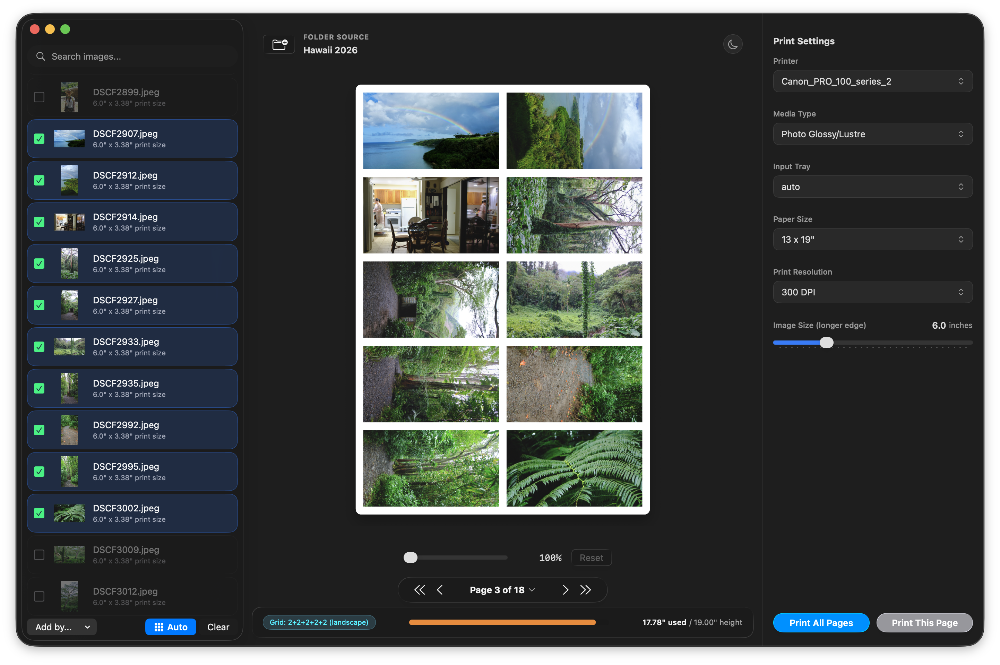

# PhotoPrint



PhotoPrint is a macOS utility application built with Swift and SwiftUI. It streamlines the process of printing multiple photos onto single paper sheets, automatically arranging them using a bin-packing layout algorithm to maximize space utilization.

It interfaces directly with the native macOS CUPS printing system to discover printers and submit print jobs.

## Features

- 📁 **Smart Folder Source & Filtering:** Select any directory containing images. Search and filter through files in real-time.
- 📐 **Dynamic Layout Engine:** Automatically arranges selected photos to fit your chosen paper size in portrait or landscape, minimizing wasted paper.
- 🖨️ **CUPS Printer Integration:**
  - Automated discovery of active local and network printers.
  - Dynamically queries and configures printer options (e.g., Media Type, Input Slot/Tray).
  - Submits jobs using native CUPS options via `lp`.
- 📋 **Automated Multi-Page Batching:** Need to print a lot of photos? The *Auto-Batch* feature groups all unprinted images onto multiple pages automatically, allowing you to preview and print them one by one or all at once.
- 🏷️ **Finder Tags Selection:** Integration with macOS Finder tags allows you to quickly select images tagged with specific colors (e.g., "Red").
- 🖼️ **High-Resolution Rendering:** Composite sheets are drawn at 300 DPI using Core Graphics and exported as lossless TIFF files prior to printing.
- ⚡ **Optimized Performance:** Uses a thread-safe thumbnail cache (`NSCache` and asynchronous `CGImageSourceCreateThumbnailAtIndex`) for fluid UI scrolling, even with directories containing hundreds of high-res photos.

## Project Structure

- `PhotoPrintApp.swift` — Application entry point.
- `ContentView.swift` — The primary SwiftUI split-view workspace. Contains layout UI, sidebar controls, canvas, and printing pipeline status.
- `Models.swift` — Core structs defining data models (e.g., `ImageFile`, `PrintConfig`, `PaperPreset`, `LayoutItem`).
- `LayoutEngine.swift` — Core layout matching and bin-packing calculations.
- `ImageCompositor.swift` — Handles image metadata extraction (dimensions, orientation, tags) and generates high-resolution composite images.
- `PrinterManager.swift` — Executes system CUPS CLI tools (`lpstat`, `lpoptions`, `lp`) to manage printer actions.
- `build.sh` — Bash build script for compiling the app bundle from source.
- `Info.plist` — Standard macOS App configuration.

## System Requirements

- **OS:** macOS 26 (Tahoe) or later. The app uses Liquid Glass window styling and custom window chrome that require macOS 26.
- **Tools:** Xcode Command Line Tools (specifically `swiftc` compiler).

## How to Build

A shell script is provided to compile and assemble the application bundle. Run the following command in the root directory:

```bash
chmod +x build.sh
./build.sh
```

Upon successful compilation, `PhotoPrint.app` will be created in the project root. You can run the application directly from the terminal or finder:

```bash
open PhotoPrint.app
```

## How It Works

1. **Open Directory:** Click the **Folder Source** button to select a folder containing images.
2. **Configure Settings:** Choose your printer, media tray, media type, and target paper size (presets include Standard Letter, 4x6", 5x7", 8x10", 11x14", 13x19", or Custom dimensions).
3. **Adjust Image Scale:** Slide the **Image Scale** slider to set the target size for the images. The layout will update in real-time.
4. **Select Images:** Check the checkboxes of the images you want to print. If an image will not fit on the current page, its checkbox will be disabled.
5. **Auto-Batch (Optional):** Click **Auto-Batch** to automatically pack all unprinted images in the directory across multiple sheets. Use the page controls below the canvas to paginate.
6. **Print:** Click **Print Current Page** (or **Print All Pages** if using Auto-Batch) to output the high-resolution composite sheet to the printer.
